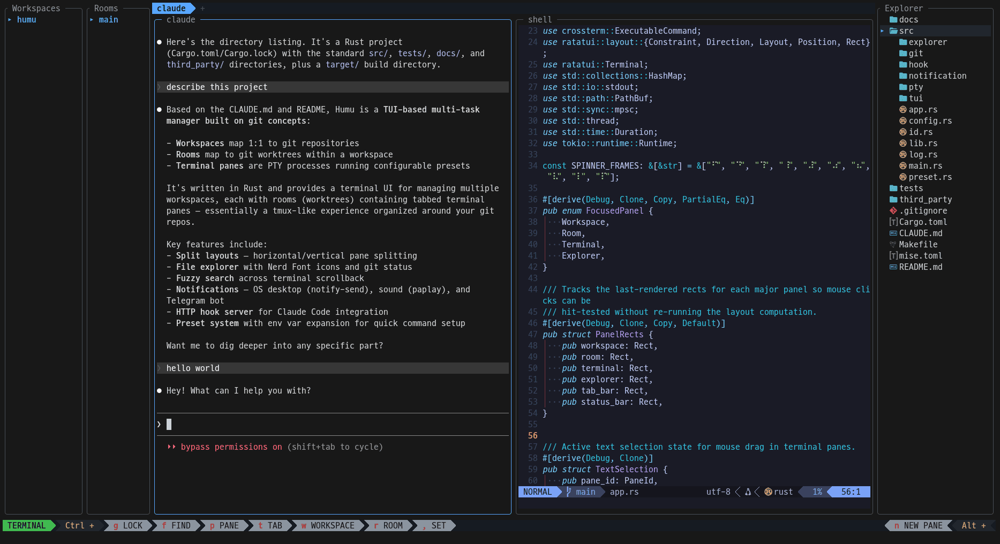

# HuMu

> **A TUI workspace manager for developers who run multiple projects simultaneously.**

HuMu organizes your terminal workflow around git concepts: **workspaces** map to repositories, **rooms** map to worktrees, and each room contains tabbed terminal panes running your tools. Switch between projects instantly without losing state.



## Features

**Workspace Management**
- Register, clone, or init git repositories as workspaces
- Each workspace tracks its rooms (worktrees) independently
- Switch between workspaces with state preserved

**Room Management**
- Rooms are git worktrees -- work on multiple branches simultaneously
- Each room remembers its tab layout and pane arrangement
- Hot-switch between rooms: PTY processes stay alive in suspended rooms

**Terminal Panes & Tabs**
- Split panes horizontally/vertically with configurable ratios
- Multiple tabs per room with Powerline-style tab bar
- Presets for quick spawning (e.g., `claude`, `gemini`, `shell`, custom commands)
- Full terminal emulation via vt100 with 10,000-line scrollback

**File Explorer**
- Directory tree with Nerd Font icons (40+ file types with per-type colors)
- Live git status indicators on files and directories (even collapsed ones)
- Open files in `$EDITOR` or view diffs with [delta](https://github.com/dandavison/delta) -- both in a floating pane overlay
- Auto-refreshes git status every ~3 seconds

**Notifications**
- Desktop notifications (`notify-send`) and sound (`paplay`) when Claude or Gemini agents need input or finish
- Telegram Bot API integration for remote alerts
- Per-channel focus-aware control: suppress notifications when HuMu is focused
- Credentials encrypted at rest (AES-256-GCM)

**AI Agent Integration (Claude, Gemini)**
- HTTP hook server receives agent state events (Working, NeedsInput, Idle)
- Animated spinners on workspaces, rooms, and tabs with active agents
- Session persistence across restarts

**Codex Integration**
- Built-in `codex` preset
- Session persistence across restarts via `codex resume SESSION_ID`
- Agent state inferred from Codex session JSONL files (`task_started` -> Working, `task_complete` -> Idle)
- `NeedsInput` is not currently available for Codex

## Installation

### Prerequisites

- Rust 2024 edition (1.85+)
- A [Nerd Font](https://www.nerdfonts.com/) for file explorer icons
- [delta](https://github.com/dandavison/delta) for diff viewing (optional)

### Install from GitHub

```bash
cargo install --git https://github.com/hhk7734/humu.git
```

### Build from source

```bash
git clone https://github.com/hhk7734/humu.git
cd humu
cargo install --path .
```

## Keybindings

### Mode Switching (from any mode)

| Key | Action |
|-----|--------|
| `Ctrl+Q` | Quit (global) |
| `Ctrl+G` | Toggle Locked mode |
| `Ctrl+P` | Toggle Pane mode |
| `Ctrl+T` | Terminal mode |
| `Ctrl+W` | Workspace mode |
| `Ctrl+R` | Room mode |
| `Ctrl+E` | Explorer mode |
| `Ctrl+F` | Search mode |
| `Ctrl+,` | Settings |

### Terminal Mode

All keys pass through to the active pane. Use `Ctrl+` keys above to switch modes.

| Key | Action |
|-----|--------|
| `Alt+N` | New pane |
| `Alt+Arrow` | Move focus between panels |

### Explorer Mode

| Key | Action |
|-----|--------|
| `Arrow Up/Down` | Navigate tree |
| `Enter` | Open file / toggle directory |
| `Shift+Enter` | View diff (delta, side-by-side) |
| `Shift+I` | Toggle gitignored files |
| `Shift+Arrow` | Resize panel |

### Pane / Tab Mode

| Key | Action |
|-----|--------|
| `N` | New pane/tab |
| `D` | Delete pane/tab |
| `Arrow` | Navigate / switch |
| `Shift+Arrow` | Resize |

## Configuration

Config lives at `~/.humu/config.yaml`:

```yaml
presets:
  claude:
    command: claude
  gemini:
    command: gemini
  codex:
    command: codex
  shell:
    command: $SHELL

ui:
  simplified_ui: false
  rounded_corners: true

notifications:
  os:
    enabled: true
    only_unfocused: true
  sound:
    enabled: true
    only_unfocused: false
  telegram:
    enabled: false
    only_unfocused: false
```

## License

MIT
