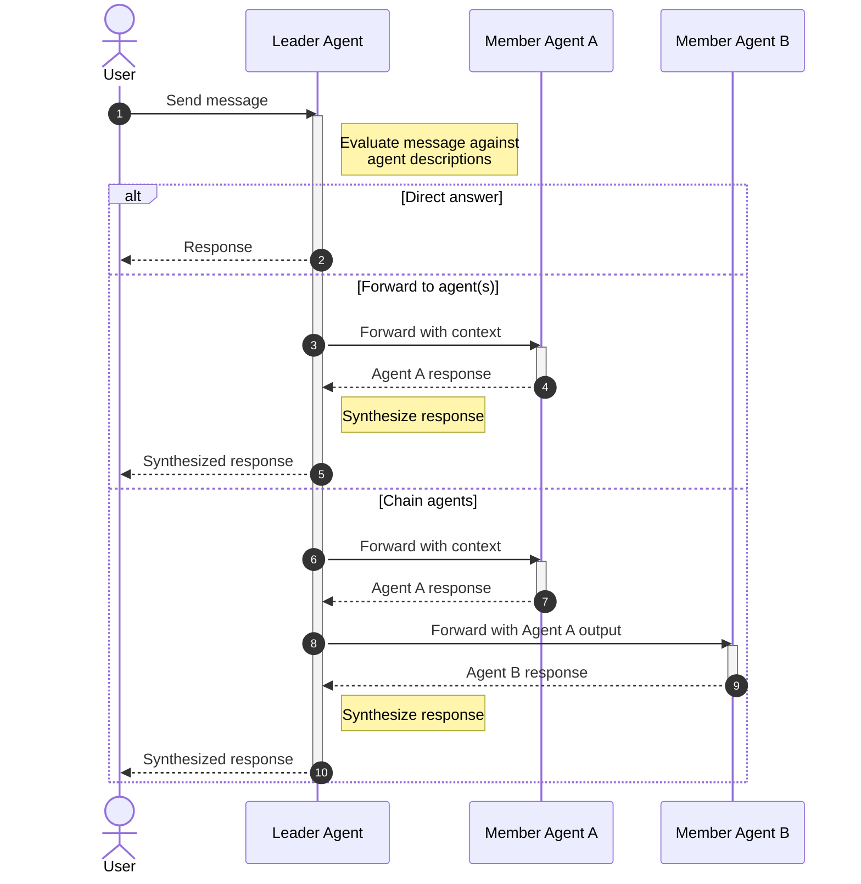

# Humu — TUI Multi-Agent Chat Application

## Overview

Humu is a terminal-based multi-agent chat application built with **Textual** and the **Claude Agent SDK**. Users create workspaces tied to project directories, organize conversations into rooms, and invite AI agents with different roles. A leader agent in each room reads user messages and either responds directly or routes them to the right member agents.

## Core Concepts

Workspaces, rooms, and agents are the three core resources. See [003-resource-management.md](003-resource-management.md) for full CRUD details, storage paths, and deletion behavior.

- **Workspace** — maps to a project root path; agents run with `cwd` set to that path.
- **Room** — a conversation space with one leader agent and zero or more member agents.
- **Agent** — a Claude-powered participant with a name, prompt, model, and tools.
- **Leader Agent** — routes user messages to the right member agents.

## Message Routing Flow



### Leader Routing Protocol

The leader agent uses `output_format` (JSON schema) to return structured decisions:

```json
{"action": "direct", "message": "..."}
```

```json
{"action": "forward", "targets": ["agent-a"], "context": "..."}
```

```json
{
  "action": "chain",
  "steps": [
    {"agent": "agent-a", "context": "..."},
    {"agent": "agent-b", "context": "use output from agent-a"}
  ]
}
```

## UI & Key Bindings

See [001-ui-components.md](001-ui-components.md) for the full TUI layout, panel descriptions, and widget details. See [implemented-features.md](implemented-features.md) for the complete key binding reference.

## Persistence

See [003-resource-management.md](003-resource-management.md) for detailed storage paths and deletion behavior.

## Claude Agent SDK Integration

Each agent wraps a `ClaudeSDKClient` instance:

- One session per (agent, room) pair
- `cwd` set to the workspace root path
- `session_id` stored for resume on restart
- Leader agent uses `output_format` with JSON schema for structured routing decisions
- Streaming controlled per-agent via `include_partial_messages`

## Architecture

See [002-client-server-architecture.md](002-client-server-architecture.md) for the client-server architecture, package structure, and communication protocol.

## Error Handling

| Scenario                 | Behavior                                                  |
| :----------------------- | :-------------------------------------------------------- |
| Agent session lost       | Start fresh session, log warning in chat                  |
| Leader routing malformed | Treat entire response as direct answer                    |
| Agent not in room        | Leader gets error, asked to re-route or answer directly   |
| API rate limit / error   | Display `[error]` in chat, user can retry                 |
| Workspace path missing   | Warn on switch, allow creating directory or updating path |
| Multiple agent forwards  | Run sequentially to keep chat readable                    |

## Dependencies

- `claude-agent-sdk` — Claude Agent SDK for Python
- `textual` — TUI framework
- `websockets` — async WebSocket library (client-server IPC)

## Non-Goals

- No auth system (single user, local app)
- No retry logic beyond what the SDK provides
- No parallel agent execution (sequential for readability)
