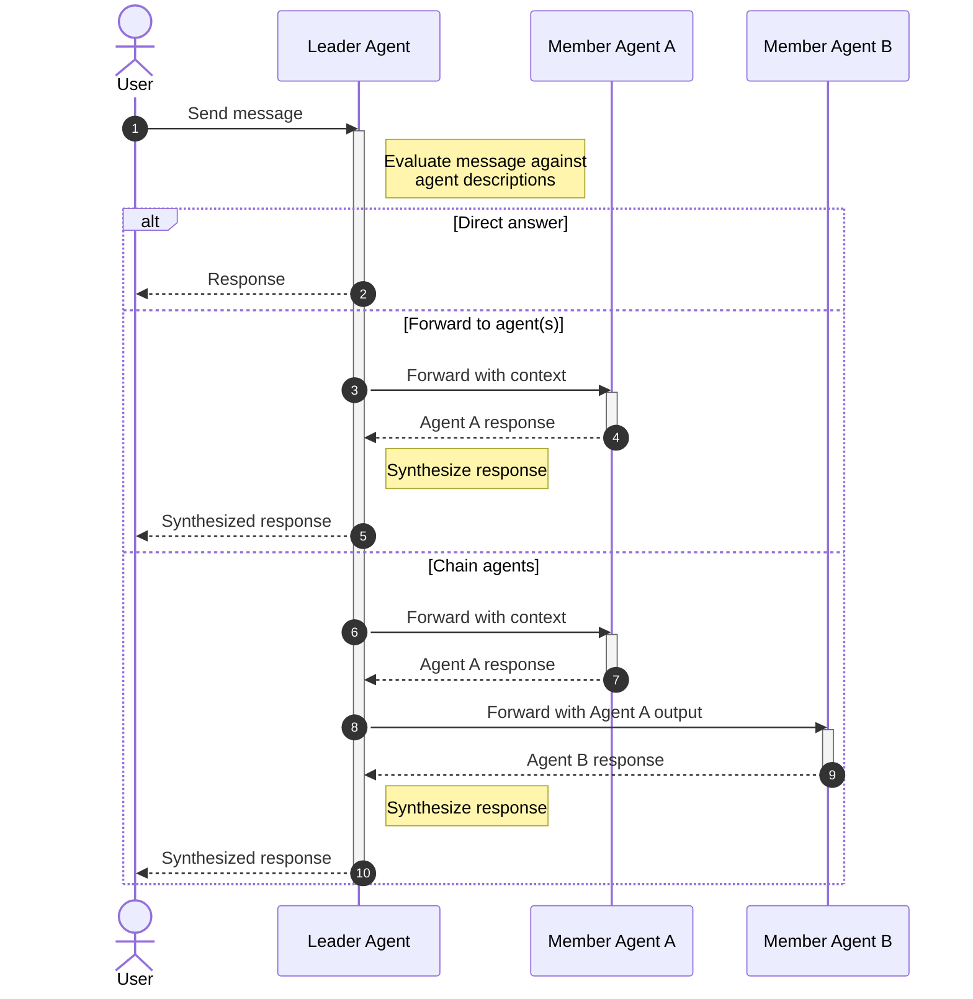

# Humu — TUI Multi-Agent Chat Application

## Overview

Humu is a terminal-based multi-agent chat application built with **Textual** and the **Claude Agent SDK**. Users create workspaces tied to project directories, organize conversations into rooms, and invite AI agents with different roles. A leader agent in each room reads user messages and either responds directly or routes them to the right member agents.

## Core Concepts

Workspaces, rooms, and agents are the three core resources. See [resource-management.md](resource-management.md) for full CRUD details, storage paths, and deletion behavior.

- **Workspace** — maps to a project root path; agents run with `cwd` set to that path.
- **Room** — a conversation space with one leader agent and zero or more member agents.
- **Agent** — a Claude-powered participant with a name, prompt, model, and tools.
- **Leader Agent** — routes user messages to the right member agents.

## Message Routing Flow



### Leader Routing Protocol

The leader agent uses `output_format` (JSON schema) to return structured decisions:

```json
{"action": "direct", "message": "..."}
```

```json
{"action": "forward", "targets": ["agent-a"], "context": "..."}
```

```json
{
  "action": "chain",
  "steps": [
    {"agent": "agent-a", "context": "..."},
    {"agent": "agent-b", "context": "use output from agent-a"}
  ]
}
```

## TUI Layout

```
+-- Workspace -+- Rooms --+- Chat ---------------------+- Agents --+
|              |          |                            |           |
| > my-app     | > design | [you] How should we       | * leader  |
|   infra      |   dev    | structure the API?        |   backend |
|   docs       |   review |                           |   security|
|              |          | [leader] Forwarding to    |           |
|              |          | backend...                |           |
|              |          |                           |           |
|              |          | [backend] I recommend     |           |
|              |          | REST with...              |           |
|              |          |                           |           |
|              |          | [leader] Based on         |           |
|              |          | backend's analysis...     |           |
|              |          +----------------------------+           |
|              |          | > your message here...    |           |
+--------------+----------+----------------------------+-----------+
```

### Panels

- **Workspace** — list/select workspaces
- **Rooms** — rooms in current workspace
- **Chat** — message history with sender labels + input at bottom
- **Agents** — agents in current room, leader marked with `*`

### Key Bindings

| Key      | Action                                              |
| :------- | :-------------------------------------------------- |
| `Ctrl+N` | Create new (workspace/room/agent per focused panel) |
| `Ctrl+D` | Delete selected item                                |
| `Tab`    | Cycle panel focus                                   |
| `Enter`  | Send message (in chat input)                        |
| `/`      | Command mode (`/invite`, `/kick`, etc.)             |

## Persistence

See [resource-management.md](resource-management.md) for detailed storage paths and deletion behavior.

## Claude Agent SDK Integration

Each agent wraps a `ClaudeSDKClient` instance:

- One session per (agent, room) pair
- `cwd` set to the workspace root path
- `session_id` stored for resume on restart
- Leader agent uses `output_format` with JSON schema for structured routing decisions
- Streaming controlled per-agent via `include_partial_messages`

## Project Structure

```
humu/
+-- __init__.py
+-- main.py                     # Entry point, Textual App
+-- models/
|   +-- workspace.py            # Workspace dataclass
|   +-- room.py                 # Room dataclass
|   +-- agent.py                # Agent dataclass
+-- services/
|   +-- agent_runner.py         # Manages ClaudeSDKClient sessions
|   +-- router.py               # Parses leader response, dispatches to agents
|   +-- storage.py              # Read/write JSON files under ~/.humu/
+-- tui/
|   +-- app.py                  # Textual App class, screen layout
|   +-- widgets/
|   |   +-- workspace_panel.py
|   |   +-- room_panel.py
|   |   +-- chat_panel.py
|   |   +-- agent_panel.py
|   +-- screens/
|       +-- create_workspace.py
|       +-- create_room.py
|       +-- create_agent.py
+-- config.py                   # Paths, defaults
```

### Responsibilities

- **models/** — pure data, no SDK dependency
- **services/agent_runner.py** — wraps `ClaudeSDKClient`, handles connect/query/resume/disconnect
- **services/router.py** — takes leader's structured JSON, calls agent runners, collects results, feeds back to leader
- **services/storage.py** — all file I/O for workspaces, rooms, agents, sessions
- **tui/** — Textual widgets and screens, calls services, never touches SDK directly

## Error Handling

| Scenario                 | Behavior                                                  |
| :----------------------- | :-------------------------------------------------------- |
| Agent session lost       | Start fresh session, log warning in chat                  |
| Leader routing malformed | Treat entire response as direct answer                    |
| Agent not in room        | Leader gets error, asked to re-route or answer directly   |
| API rate limit / error   | Display `[error]` in chat, user can retry                 |
| Workspace path missing   | Warn on switch, allow creating directory or updating path |
| Multiple agent forwards  | Run sequentially to keep chat readable                    |

## Dependencies

- `claude-agent-sdk` — Claude Agent SDK for Python
- `textual` — TUI framework

## Non-Goals

- No auth system (single user, local app)
- No plugin system (agents and tools are the extension points)
- No retry logic beyond what the SDK provides
- No parallel agent execution (sequential for readability)
